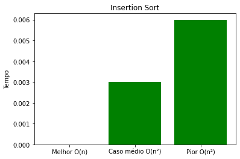
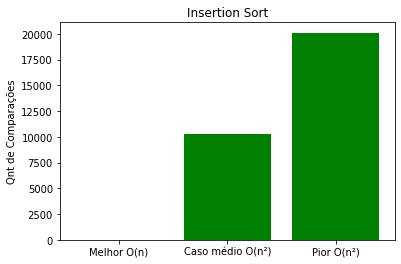

# Repositório destinado ao exercicio 1 de CPA

```
Repositório criado a partir do software Jupyter Notebook

Todos os algoritmos foram análisados em questão de quantidade de comparações e tempo de execução, dado uma entrada  A[5,...,1000, passo=5].

Os gráficos são separados em Melhor, Pior e Caso médio e ao final é dado a complexidade de cada um dos casos.
```

```
Algotirmos análisados: Insertion Sort, Merge Sort, Selection Sort, Bubble Sort, Heap Sort e Quick Sort

Para execução basta clicar no botão "Run All" disponibilidade pelo software que todos os algoritmos serão compilados. Posteriormente é possível executar o bloco onde será feita a análise assintótica e criar os gráficos comparativos, sendo eles 2 gráficos para cada algoritmo, tempo e quantidade de comparações.
```

## Exemplo de plotagem de gráfico


